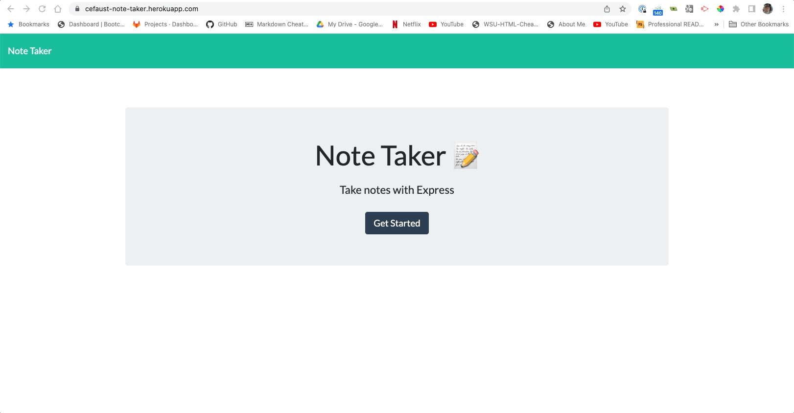

# Note-taker

### Description

With this project I was tasked with creating an application that can be used to write and save files. The application
will use Express.js on the back en and save and retrieve note data from a JSON file. This application will be deployed
on Heroku.

### Things i included in this project

1. When the user opens the note taker they are presented with a landing page.
2. When the user clicks the link they are taken to the notes page.
3. The user will then be presented with existing notes on the left of the page, plus fields to write a new note title
   and note text on right side of page.
4. When the user enters a new note title and note text they will be presented with a save icon to save the note.
5. After clicking save icon the note appears on left side of screen.
6. When clicking on the existing note the user can see that note on the right side of the screen.
7. When the user clicks on the add symbol at the top the user is able to write another note.

[GitHub pages](https://github.com/cefaust/note-taker)